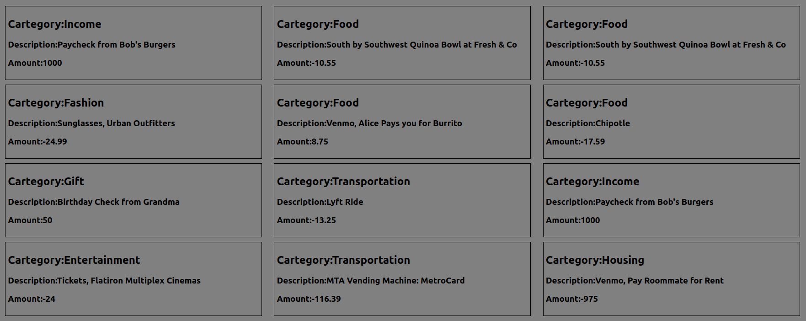
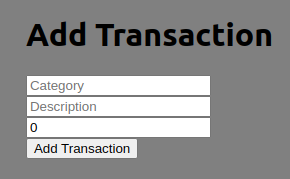
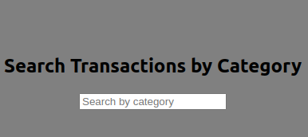
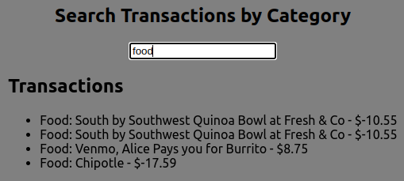

# Phase 2 week 1 Code challange (Bank of Flatiron)

## By Namada Junior

## Project Description

For this project, this React application displays a list of your recent bank transactions, among other feature such as adding a new trnasaction and searching for and existing transactions
This is the link to the website:[(https://phase-2-week-1-codechallange.vercel.app/)](https://phase-2-week-1-codechallange.vercel.app/)

## Features of the project
The table of transactions

This it the inputfield used to add new transactions

This is the search bar that is used to look for specific transactions by category.

if there is a matching category the search bar will return a results

## System Requirements

- Node 18+
- A browser capable of running JavaScript (Chrome, Firefox, Safari, or Edge)
- Operating System (Windows 10+, MacOS, Linux, etc.)
- A text editor capable of running JavaScript (Visual Studio Code, React, etc.)
- RAM >= 4GB
- Disk space >= 1GB

## Development

Want to contribute? Excellent, To enhance or contribute on the existing project, follow these steps:

- Fork the repo
- Create a new branch (git checkout -b enhance-feature)
- Make the appropriate changes in the files
- Add changes to reflect the changes made
- Commit your changes (git commit -m 'enhanced feature')
- Push to the branch (git push origin enhance-feature)
- Create a Pull Request

## License

MIT License

Copyright (c) [2024] [Namada Junior]

Permission is hereby granted, free of charge, to any person obtaining a copy
of this software and associated documentation files (the "Software"), to deal
in the Software without restriction, including without limitation the rights
to use, copy, modify, merge, publish, distribute, sublicense, and/or sell
copies of the Software, and to permit persons to whom the Software is
furnished to do so, subject to the following conditions:

The above copyright notice and this permission notice shall be included in all
copies or substantial portions of the Software.

THE SOFTWARE IS PROVIDED "AS IS", WITHOUT WARRANTY OF ANY KIND, EXPRESS OR
IMPLIED, INCLUDING BUT NOT LIMITED TO THE WARRANTIES OF MERCHANTABILITY,
FITNESS FOR A PARTICULAR PURPOSE AND NONINFRINGEMENT. IN NO EVENT SHALL THE
AUTHORS OR COPYRIGHT HOLDERS BE LIABLE FOR ANY CLAIM, DAMAGES OR OTHER
LIABILITY, WHETHER IN AN ACTION OF CONTRACT, TORT OR OTHERWISE, ARISING FROM,
OUT OF OR IN CONNECTION WITH THE SOFTWARE OR THE USE OR OTHER DEALINGS IN THE
SOFTWARE.
